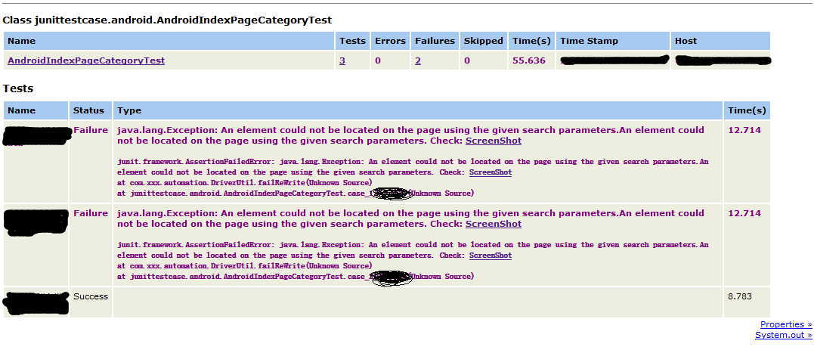

# MacacaAutomation
用Java基于wd.java编写的自动化测试框架，maven工程，集成Junit和Ant维护用例和生成测试报告，底层框架全部来自https://github.com/macacajs

改造了junit默认的report结果，在case错误时候，自动截屏保存图片，并把图片添加在报告文件中，方便检查定位。

报告截图



# 前提条件

安装macaca套件，在工程的目录MacacaAutomation 执行```macaca server --verbose```启动macaca服务进程


未完待续
