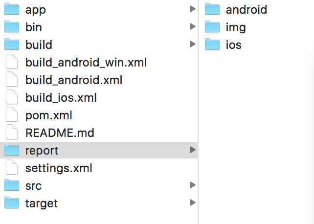

# 简介
MacacaAutomation用Java基于wd.java编写的自动化测试框架，maven工程，集成Junit和Ant维护用例和生成测试报告，底层框架全部来自https://github.com/macacajs

改造了junit默认的report结果，在case错误时候，自动截屏保存图片，并把图片添加在报告文件中，方便检查定位。


# 环境信息

Eclipse: Mars.2 (4.5.2)

macaca: 1.2.0

macacaclient: 2.0.1

Junit: 4.12

ant: eclipse自带

# 下载Macaca套件

下载Macaca套件，全局安装，包括，macaca-cli macaca-ios app-inspector macaca-android

```
npm install macaca-cli -g

npm install macaca-ios -g

npm install macaca-android -g

npm install app-inspector -g
```

MAC全局安装的路径分别如下：

```
/usr/local/lib/node_modules/macaca-cli
/usr/local/lib/node_modules/macaca-ios
/usr/local/lib/node_modules/macaca-android
/usr/local/lib/node_modules/app-inspector
```

# WebDriverAgent项目重签名

查找WebDriverAgent项目发现有两个，都需要使用xcode重新签名

我使用的是自己的苹果账号，有个限制就是，有效期是7天，过期之后需要重新签名，有个开发者账号最好，没有也能用，过期了再签一次就可以了。

 ```
/usr/local/lib/node_modules/app-inspector/node_modules/.1.0.41@webdriveragent/WebDriverAgent
/usr/local/lib/node_modules/macaca-ios/node_modules/.1.0.41@webdriveragent/WebDriverAgent
```
或者
```
/usr/local/lib/node_modules/macaca-ios/node_modules/webdriveragent/WebDriverAgent
/usr/local/lib/node_modules/macaca-inspector/node_modules/webdriveragent/WebDriverAgent
```
这个目录，由于webdriveragent -> .1.0.41@webdriveragent  是软连接，其实是一样的。

第一个目录的项目是inspector功能执行时候，自动化安装WDA到iPhone上，为的是在手机启动WDA，可以查看手机UI控件布局。

第二个目录是在UI自动化脚步时候，自动化安装WDA到iPhone上，为的是在手机启动WDA，可以执行ui case的指令。

上面两个目录下各自找到项目文件，Xcode打开，下图中的［1］［2］team重新选择，原则上就可以直接使用，保险起见，把5处全部修改，保证不出错。

接着修改Bundle Identifier，每个项目中能改的全部改掉，换个名字即可，比如把各处的id中的facebook改成abc

放个截图：

# 改造Junit断言方法，把图片加到报告中

代码如下，主要是添加了screenShot方法，重写fail方法，重写assertTrue方法等等，用到哪个断言，都可以重写，进入断言时候，截图保存下来，然后把图片地址加到AssertionError入参中，即可在报告中看到图片。
```
public class DriverUtil {

	static MacacaClient driver = Driver.driver;
	
	static public void failReWrite(String message) {
		String imgurl = screenShot();
		if (message == null) {
            throw new AssertionError();
        }
        throw new AssertionError(message+" Check:"+imgurl);
	}
	
	
	static public void assertTrueReWrite(String message, boolean condition) {
        if (!condition) {
        	failReWrite(message);
        }
    }
	
    
    public static String getDateTime(){  
        SimpleDateFormat df = new SimpleDateFormat("yyyyMMddHHmmss");  
        return df.format(new Date());  
    }
    
    
    public static String screenShot(){
    	
    	File directory = new File("");
    	String courseFile;
	    try {
	    	courseFile = directory.getCanonicalPath();
	    	String imgname = courseFile+"/report/img/img"+getDateTime()+".png";
	    	System.out.println("-------imgname----------"+imgname);
	    	driver.saveScreenshot(imgname);
	    	return imgname;
		} catch (IOException e) {
			System.out.println("获取路径失败，报错信息："+e.getMessage());
			return "";
		} catch (Exception e1) {
			System.out.println("截图失败，报错信息："+e1.getMessage());
			return "";
		}
	}
}

```

```
        throw new AssertionError(message+" Check:"+imgurl); 
```
这处代码是把截图的完整路径添加到报告中，能在报告中看到图片的地址，但是还不是个链接。

后来原本是想把图片的url，直接改成a标签，如下：
```
        throw new AssertionError(message+" Check:"+"<target=\"_blank\" href=\"file://"+imgurl+"\">ScreenSho</a>");
```
但是万恶的标签的‘<’‘>’ 符号不允许直接添加到html中，这样到最终的报告中'<' '>' 展示成转码之后的字符，不能凑成a标签，但是要从根源上解决这个问题，需要修改junit的源代码，所以想了个比较折中的方式，先把‘<’ ‘>’ 用一串正常的字符代替，生成报告之后，在用批量处理脚本，把代替的字符替换回来即可。ltltlt代替‘<’ , gtgtgt代替‘>’，最终代码入下：
```
        throw new AssertionError(message+" Check:"+" ltltlta target=\"_blank\" href=\"file://"+imgurl+"\"gtgtgtScreenShotltltlt/agtgtgt");
```

批量替换的脚本使用sed命令完成。


最终的效果图，点击报告中的ScreeShot，会在新的页面中直接展示图片


# 5.github项目位置
所有的代码除去了公司的相关信息，case只保留了一条，整理之后都上传了github，地址是：https://github.com/baozhida/MacacaAutomation
下载到本地，java开发工具打开，稍做修改，即可执行

项目的文件结构：


app是存放 app安装包的

bin下面是可执行脚本

report是测试报告的位置

src是java代码

安装macaca套件之后，在工程的目录MacacaAutomation 执行```macaca server --verbose```启动macaca服务进程，之后运行build文件执行case即可。

```
build_ios.xml
```
这个build是MAC上执行IOS case的入口
```
build_android.xml
```
这个build是MAC上执行android case的入口
```
build_android_win.xml
```
这个build是Windows上执行android case的入口

### 现在是初步的实现，MAC上执行IOS/Android，在Windows上执行Andrid UI自动化都正常实现，生成有图片的报告，比较粗糙，后面会持续更新
